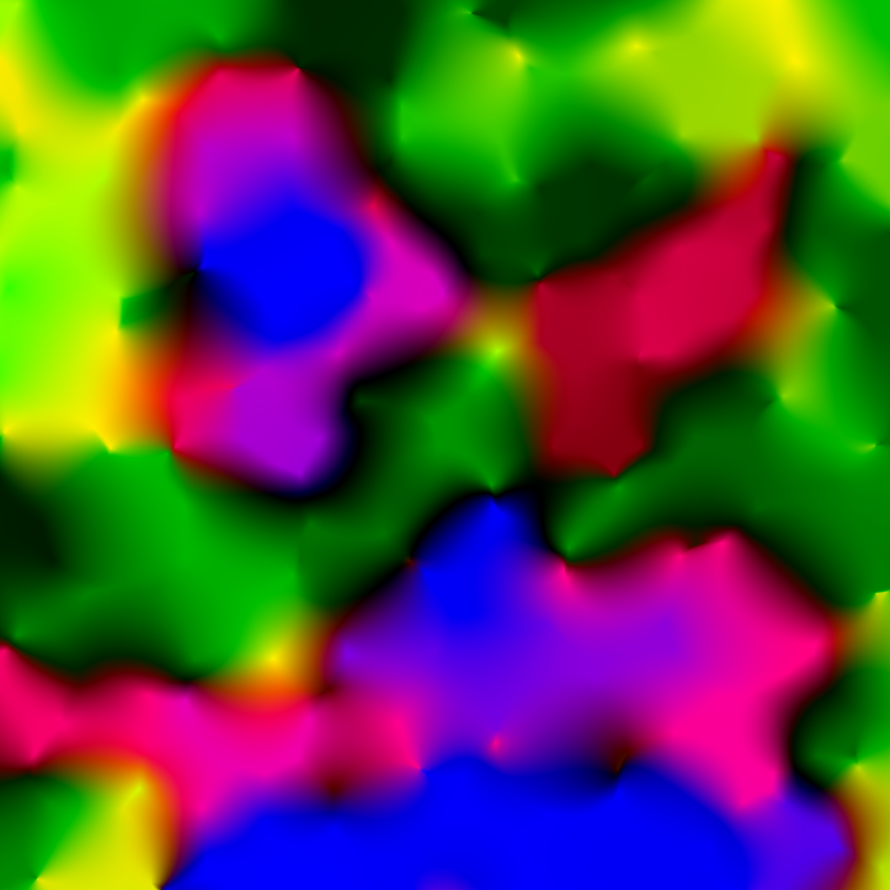
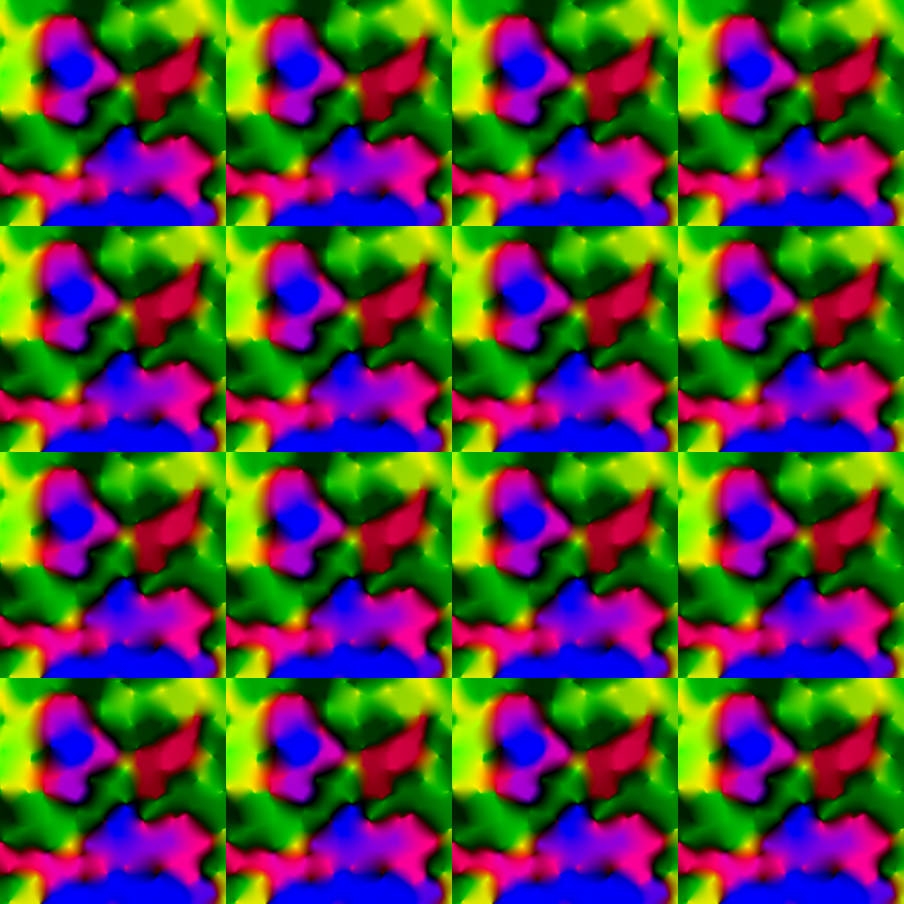
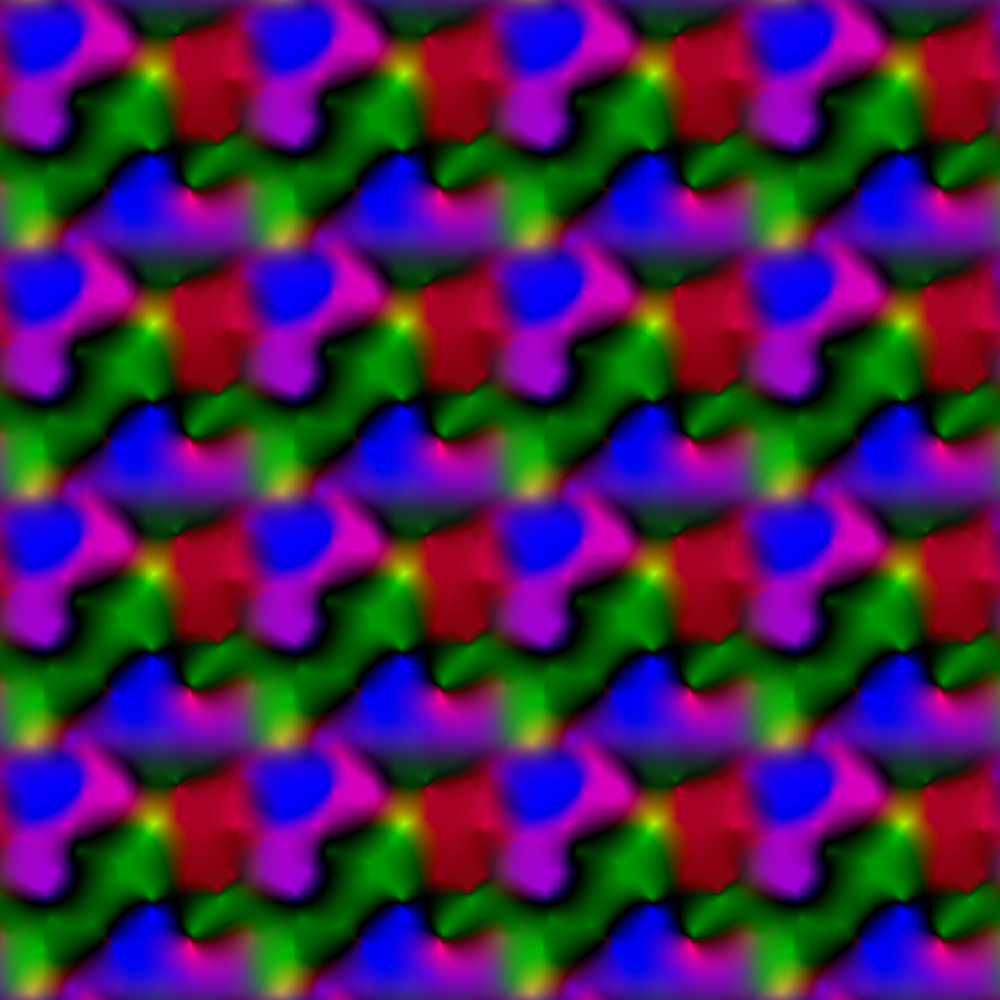

# Tile Maker
This utility is used for creating seamless tiling textures by means of Gaussian masked overlapping.  A variety of different parameters allow for fine control of how the output texture is generated which can allow for more realistic looking textures.  Much of the parameters for tuning the outputs are varied based on the particular image to be tiled and for the most part must be adjusted from the default parameters to obtain acceptable results.

## Installation
Make sure you have gcc-4.8.4 or greater installed on your machine which can be achieved by executing:
```sh
$ sudo apt-get install gcc
```

Next make sure you are in the base directory and compile the binary by executing:
```sh
$ make
```

The binary will be compiled to the same directory and produce the binary _tilemaker_.

## Usage
In order to execute this utility, run it from the command-line as below:

```sh
$ ./tilemaker input.png output.png [options]
```

Where *[options]* can be any of the flags described below:
- `-c [R,G,B]` -- Background Color (used in non-overlapping areas)
- `-o [num]` -- Octave where: 2^Octave = Number of repeats
- `-h [num]` -- Tile height
- `-w [num]` -- Tile width
- `-m [num]` -- Mask blur (Gaussian sigma value)
- `-R [num]` -- Base rotation value (Default=0.0)
- `-r [num]` -- Rotation variance (Default=0.0)
- `-S [num]` -- Base scale value (Default=1.0)
- `-s [num]` -- Scale variance (Default=0.0)
- `-x [num]` -- Random seed (Default=0 implies none)


## Examples
You can test this utility by running the following examples to get these results from a given input:

#### Input1.png:


```sh
$ ./tilemaker ./examples/input1.png ./examples/output1.png
```

#### Output1.png:


```sh
./tilemaker ./examples/input1.png ./examples/output2.png -o 2 -h 500 -w 500 -m 0.1
```

#### Output2.png:

